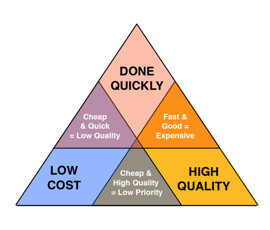

Have you ever come across the concept known as the [**Project Management Triangle**](https://en.wikipedia.org/wiki/Project_management_triangle)? It’s a simple but powerful idea that highlights the inevitable tradeoffs in any creative or development project. At each point of the triangle are the three most important factors that influence a project’s success: **Time** , **Cost** , and **Scope**. **The catch is that you can only ever prioritize two of them**.

Credit ****Duncan Haughey**** | [Understanding the Project Management Triple Constraint](https://www.projectsmart.co.uk/role-of-the-project-manager/understanding-the-project-management-triple-constraint.php)

If you want something completed quickly and on a tight budget, you’ll likely have to compromise on quality. If you’re aiming for a high-quality result but need to save on cost, then you should expect the project to take longer. On the other hand, if you want something done quickly and with top-tier quality, it’s going to be expensive. This principle applies universally no matter what you are working on; whether you’re building a website, launching a product, or producing a marketing campaign.

People often expect to get all three: fast, cheap, _and_ great. Unfortunately, that’s not how the creative world works. There has to be some give and take. The sooner you can understand where you’re willing to compromise, the better your chances of being satisfied with the final result.

As I wrote in [this series of articles](https://medium.com/design-process-playbook/a-simple-design-process-framework-that-will-allow-you-to-succeed-2b8d5d979846), I hope it’s clear that the design process doesn’t have to be overwhelming or intimidating. Whether you’re a client or a designer, having a solid grasp of your goals, clear requirements, and a structured plan can make the entire process far more manageable.

One of the biggest mistakes in any project is pushing too hard too early. Rushing into design or development without laying the groundwork is like telling someone to run before they’ve learned how to walk. I’ve been in that situation more times than I care to remember. The result is always the same: frustration, rework, burnout, and a project that feels like it’s constantly slipping out of control.

In the end, thoughtful pacing, honest conversations about tradeoffs, and mutual respect between team members make all the difference. Good design isn’t just about how something looks, it’s also about how it’s built, how it functions, and how well it serves the people who use it.