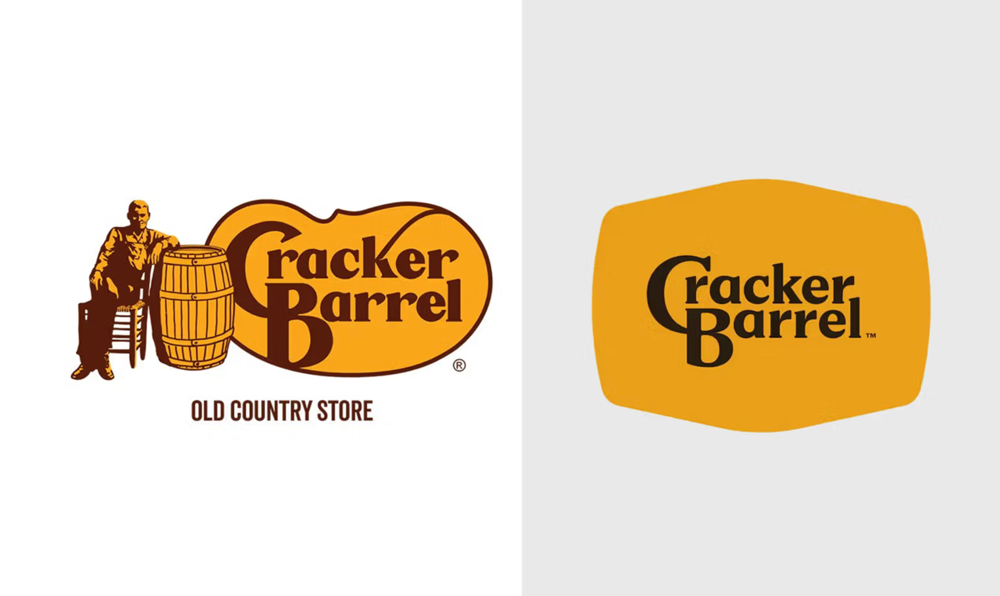

I couldn't disagree more.

I think they precisely hit the mark, but it's not the obvious one.

My parents, who are in their late 60s and mid-70s, absolutely love Cracker Barrel. They love and trust their food, they love the ambiance, and they love the brand. There is absolutely nothing wrong with that at all.

But while that audience has been sold on them for a long time, I suspect that the fine folks at Cracker Barrel want to skew a little younger and needed a more versatile design system that works for print, web, and social media.

The current logo with the old guy in a chair with his arm on a barrel and the wordmark does not work well on anything other than a big sign. It doesn't shrink down well, it doesn't look good on the web, and it doesn't look good on a phone. It has no real brandable elements to it except the wordmark.

They kept the wordmark and placed it inside a barrel on its side. They've retained the color scheme for the most part, with a caution sign-yellow-orange and a slightly darker brownish black to increase the contrast. The wordmark could have been a little bigger in the barrel shape and felt right, but what they did… it's not overly small. With this change, it became a lot more contemporary by becoming less "where your old white grandpa likes to eat dinner at 4pm" and more of a place that is appealing to younger folks. I suspect they know this because they actually did do market research of their target— _not their current_ —customer base.

It remains to be seen what all they are changing; are they still focusing on a more rural, conservative base? I would bet they are, and I would bet you will see that continue to be the case with their advertising. I think it'll be less about feeding old folks and more about giving people in their 30s, 40s, and 50s a sense of positive nostalgia. Remembering that you ate there with your grandma when you were young. Having a home-cooked meal by your grandma. Continuing traditions with your family. You don't need that old logo for those things; you do need something that communicates those feelings and ideas, however.

We've already seen some creative uses of their "CB" secondary logo, and I'm sure that barrel shape will be used all over the place in patterns, signage, and apparel. Heck, you could even go as far as having all-new plates that were in that shape to reinforce the brand. That barrel shape also reminds me of the old television my grandparents had. It was this wooden cabinet with a very similar shape that displayed the picture. 

Photo by [Dulcey Lima](https://unsplash.com/@dulceylima) / [Unsplash](https://unsplash.com/?utm_source=ghost&utm_medium=referral&utm_campaign=api-credit)

Sadly, many long-time Cracker Barrel patrons and people just looking for a reason to be angry feel like it's an attack on their culture. But you know what? These folks generally don't like change or progress in any fashion and are "just fine" with things "just like they always have been"—as if everything on this Earth were for them. When things around you change, it changes your sense of self. You feel that change in connection and feel attacked personally. That is precisely the brand equity that companies work so hard to achieve. But when that also starts to alienate your brand from potential customers who—let's be honest here—will eventually replace the old ones, you have to do what you can to be relevant to them. 

I think you'll see some backlash, and you'll see a lot of negative publicity, but it will end up only being a positive for Cracker Barrel in the long run.

* * *

_Update_

Cracker Barrel has caved to the backlash and has decided to stay with the old logo. 

This new logo, _obviously_ , was not rolled-out the way it should have been, as what they showed as "the logo" was just an element of their design system. People assumed the worst – because it wasn't communicated – and didn't understand what they were trying to do, because there was a poor explanation of what the design system was. 

If it were me, I would have shown how the system works; I would have shown that this new logo text and the barrel shape replaced the portion of the logo on the right, and the ability to put any kind of accompanying artwork on the left; they have a new illustration of Herschel they could use on occasion, or use a new, updated version of him sitting with his arm on a barrel. Then show how they are using the CB mark by itself in a barrel shape. Show the different use cases so people understand it. Explain why it needs to be cleaner. 

Explain why you did it.